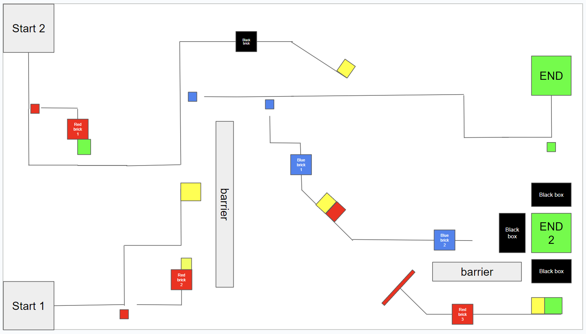

# EV3 Line Tracing

Welcome to the EV3 Line Tracing Workshop repository.

This repo contains all lesson files used during the workshop, plus competition rules and scoring details.

## Workshop Setup

### 1. Download the EV3 Classroom App

Download and install the EV3 software from:

https://education.lego.com/en-us/downloads/mindstorms-ev3/software/

After installation, open the launcher.

### 2. Download the Lesson Files

You can either:

- Download all files in [Lesson Files](./Lesson%20Files/), or
- Download the entire repository as a `.zip` file and extract it.

### 3. Complete Lessons 1 and 2

- Open the downloaded lesson files.
- Follow the lesson pace and slides.

### 4. Complete Lessons 3 to 7

- Complete these lessons at your own pace.
- After each lesson, notify one of the facilitators for verification.

## Competition Rules

After completing all 7 lessons, you may proceed to the competition stage.

- You may modify your robot and refine your code in preparation for the competition.
- The main goal is to reach either end zone while completing objectives along the way.

Competition map:

### Zone and Indicator Descriptions

| Zone | Condition for Validity |
| --- | --- |
| Start Zones 1 and 2 | Robot must be fully within the start zone before beginning. |
| End Zones 1 and 2 | For points to count, all bricks must be fully inside the green zone, and at least 50% of the robot must be inside the end zone. |
| Colored Bricks | Must be placed in the same locations after each try, based on the competition map. |
| Colored Indicators | Unlabeled colored squares on the map; teams may interpret and use them for navigation. |
| Barrier | Physical barrier; collision results in a restart. |
| Black Box | Rectangular box marked with black tape or paper. |

### Map Notes

- **Barriers** are the only physical obstacles on the map.
- **All other indicators** are 2D visual markers intended to support navigation.
- The robot may not go over the same line twice.

### Scoring Breakdown

| Task | Points if completed within 2 minutes | Points if completed within 1 minute |
| --- | ---: | ---: |
| Reach and stop in End Goal 1 | 5 | 15 |
| Reach and stop in End Goal 2 | 10 | 35 |

### Bringing Colored Debris/Bricks to the End Zone

| Brick Color | Number on Map | Points per Brick |
| --- | ---: | ---: |
| Red | 3 | 5 |
| Blue | 2 | 2 |
| Black | 1 | -5 (if touched) |

### Deviating from the Line Without Indication

Example: hard coding without clear map signals.

- The robot must restart on the next try.
- No points are awarded for the current attempt.

### Point Allocation Notes

- **End Zone Requirement:** At least 50% of the robot must be stopped within the end zone for points to be awarded.
- **Brick Placement:** Colored bricks must be fully in the end zone for points to be awarded.
- **Track Rule:** The robot is not allowed to re-enter a section of track it has already crossed. Doing so results in **automatic disqualification**.
- **Time Limit:** If the robot does not reach an end zone within **5 minutes**, the attempt is disqualified.
- **Attempts Allowed:** Each team has a maximum of **5 tries**. The highest-scoring attempt is recorded.
- **End of Run:** Once the robot stops in an end zone, **the run is considered complete**.

Ensure all rules are clearly understood before the competition begins. Good luck.
